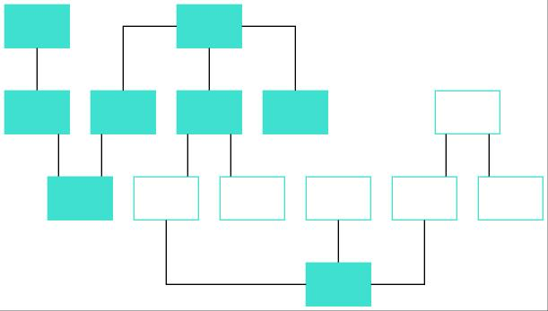
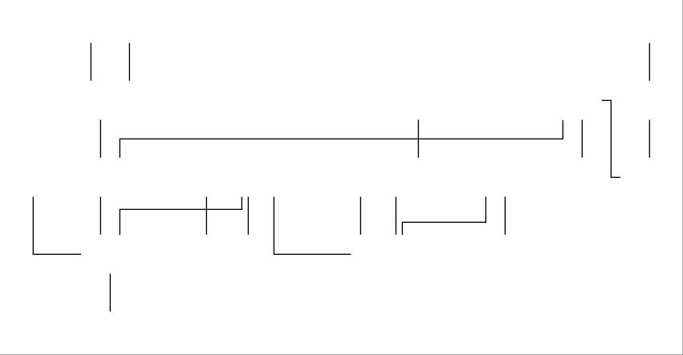

# Introduction 
This directory contains the code to generate synthetic data for training an Attention Mechanism. The synthetic data created contains graph structure with and without nodes, the labels are 0 and 1 respectively.

##Synthetic Graph with Nodes

##Synthetic Graph without Nodes

# Execution
1. Change directory in Command Line to this directory 
2. Generate Data : 
   ````
   python generate_data_attention.py (Enter file save location and the number of training and validation data)
   ````
3. Run Training : 
   ````
   python attention.py (Enter file save location and number of epochs)

In attention.py, it is possible to change parameters such as batch size and image size. 
