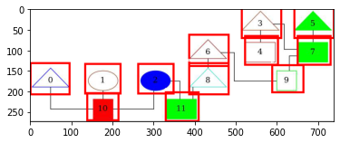

# Introduction 
This section contains the code to generate the synthetic data with annotations and splitting them into individual files. It also contains files
to run YOLO-v5 models, the files and code are taken from https://github.com/ultralytics/yolov5. 

##Synthetic Graph with Annotations


# Execution
1. Change directory in Command Line to this directory 
2. Generate Data : 
   ````
   python generate_graph_yolo.py (Enter file save location and the number of data)
   ````
3. Run Training : 
   ````
    python train.py --img 640 --cfg yolov5s.yaml --hyp hyp.scratch.yaml --batch 32 --epochs 100 --data example_graphs.yaml --weights yolov5s.pt --workers 24 --name test

Hyperparameters for the traing can be changed as suited, img is the image size, cfg is the specific YOLO model (Small to Extra Large architecture),
hyp is the hyperparameter file, batch is the batch size, weights determines whether to train from pre-trained weights or empty weights ( ' ' ), name is the name of the file.

For the parameter data, the .yaml file contains the information of where the images and labels are at. An example of what is in the .yaml file needed :

````
train : path/to/hold-IQ-phase-3/yolo/graph_data/save_name/images/train
val : path/to/hold-IQ-phase-3/yolo/graph_data/save_name/images/val
test : path/to/hold-IQ-phase-3/yolo/graph_data/save_name/images/test

nc : 1

names : ['Entities'] 
````

4. Run Pre-Trained Model for Validation and Detecton(Trained in August 2021 with Synthetic Generated Data) : 
   ````
   ## Used to detect entities, changing the confidence will change the what classifies as a detection
   python detect.py --source /path/to/images --weights runs/train/pre-trained/weights/best.pt --conf 0.25 --name save_name
   
   # Run validation of the model on the actual group structures
   python val.py  --data real_graphs.yaml --weights runs/train/pre-trained/weights/best.pt  --name save_name
   ````
   
